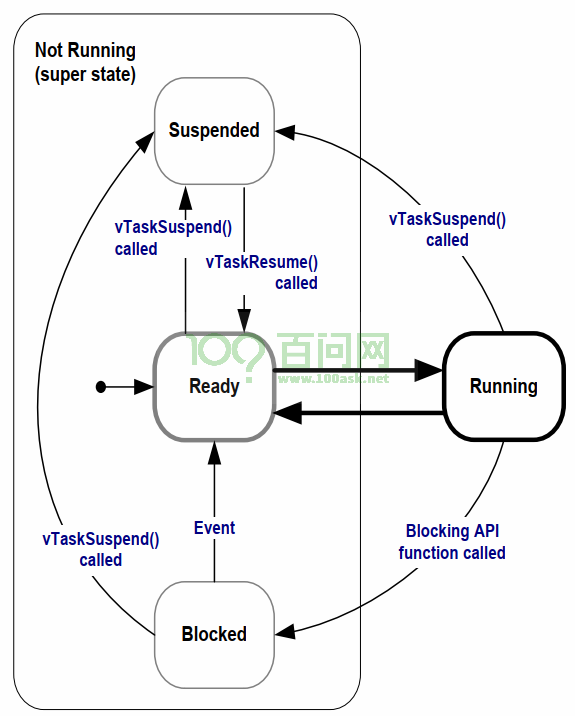
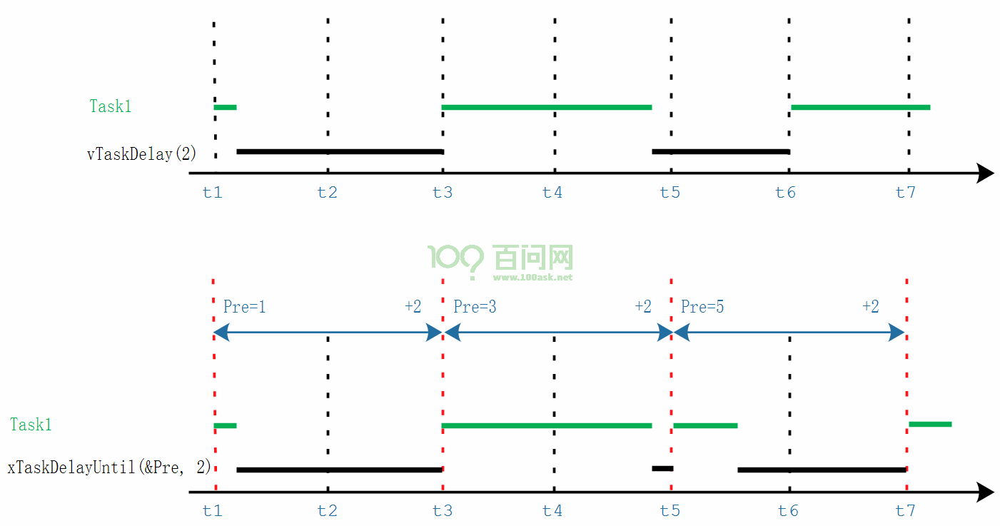

# 第9章 任务管理

在本章中，会涉及如下内容：

- FreeRTOS如何给每个任务分配CPU时间
- 如何选择某个任务来运行
- 任务优先级如何起作用
- 任务有哪些状态
- 如何实现任务
- 如何使用任务参数
- 怎么修改任务优先级
- 怎么删除任务
- 怎么实现周期性的任务
- 如何使用空闲任务

## 9.1 基本概念

对于整个单片机程序，我们称之为application，应用程序。

使用FreeRTOS时，我们可以在application中创建多个任务(task)，有些文档把任务也称为线程(thread)。


以日常生活为例，比如这个母亲要同时做两件事：
- 喂饭：这是一个任务
- 回信息：这是另一个任务
这可以引入很多概念：
- 任务状态(State)：
  - 当前正在喂饭，它是running状态；另一个"回信息"的任务就是"not running"状态
  - "not running"状态还可以细分：
    - ready：就绪，随时可以运行
    - blocked：阻塞，卡住了，母亲在等待同事回信息
    - suspended：挂起，同事废话太多，不管他了
- 优先级(Priority)
  - 我工作生活兼顾：喂饭、回信息优先级一样，轮流做
  - 我忙里偷闲：还有空闲任务，休息一下
  - 厨房着火了，什么都别说了，先灭火：优先级更高
- 栈(Stack)
  - 喂小孩时，我要记得上一口喂了米饭，这口要喂青菜了
  - 回信息时，我要记得刚才聊的是啥
  - 做不同的任务，这些细节不一样
  - 对于人来说，当然是记在脑子里
  - 对于程序，是记在栈里
  - 每个任务有自己的栈
- 事件驱动
  - 孩子吃饭太慢：先休息一会，等他咽下去了、等他提醒我了，再喂下一口
- 协助式调度(Co-operative Scheduling)
  - 你在给同事回信息
    - 同事说：好了，你先去给小孩喂一口饭吧，你才能离开
    - 同事不放你走，即使孩子哭了你也不能走
  - 你好不容易可以给孩子喂饭了
    - 孩子说：好了，妈妈你去处理一下工作吧，你才能离开
    - 孩子不放你走，即使同事连发信息你也不能走
    这涉及很多概念，后续章节详细分析。

## 9.2 任务创建与删除

### 9.2.1 什么是任务

在FreeRTOS中，任务就是一个函数，原型如下：

```c
void ATaskFunction( void *pvParameters );
```

要注意的是：

- 这个函数不能返回
- 同一个函数，可以用来创建多个任务；换句话说，多个任务可以运行同一个函数
- 函数内部，尽量使用局部变量：
  - 每个任务都有自己的栈
  - 每个任务运行这个函数时
    - 任务A的局部变量放在任务A的栈里、任务B的局部变量放在任务B的栈里
    - 不同任务的局部变量，有自己的副本
  - 函数使用全局变量、静态变量的话
    - 只有一个副本：多个任务使用的是同一个副本
    - 要防止冲突(后续会讲)
    下面是一个示例：

```c
void ATaskFunction( void *pvParameters )
{
	/* 对于不同的任务，局部变量放在任务的栈里，有各自的副本 */
	int32_t lVariableExample = 0;
	
    /* 任务函数通常实现为一个无限循环 */
	for( ;; )
	{
		/* 任务的代码 */
	}

    /* 如果程序从循环中退出，一定要使用vTaskDelete删除自己
     * NULL表示删除的是自己
     */
	vTaskDelete( NULL );
    
    /* 程序不会执行到这里, 如果执行到这里就出错了 */
}
```

### 9.2.2 创建任务

创建任务时使用的函数如下：

```c
BaseType_t xTaskCreate( TaskFunction_t pxTaskCode, // 函数指针, 任务函数
                        const char * const pcName, // 任务的名字
                        const configSTACK_DEPTH_TYPE usStackDepth, // 栈大小,单位为word,10表示40字节
                        void * const pvParameters, // 调用任务函数时传入的参数
                        UBaseType_t uxPriority,    // 优先级
                        TaskHandle_t * const pxCreatedTask ); // 任务句柄, 以后使用它来操作这个任务
```

参数说明：

| **参数**          | **描述**                                                         |
| ------------- | ------------------------------------------------------------ |
| pvTaskCode    | 函数指针，任务对应的 C 函数。任务应该永远不退出，或者在退出时调用 "vTaskDelete(NULL)"。 |
| pcName        | 任务的名称，仅用于调试目的，FreeRTOS 内部不使用。pcName 的长度为 configMAX_TASK_NAME_LEN。 |
| usStackDepth  | 每个任务都有自己的栈，usStackDepth 指定了栈的大小，单位为 word。例如，如果传入 100，表示栈的大小为 100 word，即 400 字节。最大值为 uint16_t 的最大值。确定栈的大小并不容易，通常是根据估计来设定。精确的办法是查看反汇编代码。 |
| pvParameters  | 调用 pvTaskCode 函数指针时使用的参数：pvTaskCode(pvParameters)。 |
| uxPriority    | 任务的优先级范围为 0~(configMAX_PRIORITIES – 1)。数值越小，优先级越低。如果传入的值过大，xTaskCreate 会将其调整为 (configMAX_PRIORITIES – 1)。 |
| pxCreatedTask | 用于保存 xTaskCreate 的输出结果，即任务的句柄（task handle）。如果以后需要对该任务进行操作，如修改优先级，则需要使用此句柄。如果不需要使用该句柄，可以传入 NULL。 |
| 返回值        | 成功时返回 pdPASS，失败时返回 errCOULD_NOT_ALLOCATE_REQUIRED_MEMORY（失败原因是内存不足）。请注意，文档中提到的失败返回值是 pdFAIL 是不正确的。pdFAIL 的值为 0，而 errCOULD_NOT_ALLOCATE_REQUIRED_MEMORY 的值为 -1。 |

使用静态分配内存的函数如下：

```c
TaskHandle_t xTaskCreateStatic ( 
    TaskFunction_t pxTaskCode,   // 函数指针, 任务函数
    const char * const pcName,   // 任务的名字
    const uint32_t ulStackDepth, // 栈大小,单位为word,10表示40字节
    void * const pvParameters,   // 调用任务函数时传入的参数
    UBaseType_t uxPriority,      // 优先级
    StackType_t * const puxStackBuffer, // 静态分配的栈，就是一个buffer
    StaticTask_t * const pxTaskBuffer // 静态分配的任务结构体的指针，用它来操作这个任务
);
```

相比于使用动态分配内存创建任务的函数，最后2个参数不一样：

| **参数** | **描述**                                               |
| -------------- | ------------------------------------------------------------ |
| pvTaskCode     | 函数指针，可以简单地认为任务就是一个C函数。 它稍微特殊一点：永远不退出，或者退出时要调用"vTaskDelete(NULL)" |
| pcName         | 任务的名字，FreeRTOS内部不使用它，仅仅起调试作用。 长度为：configMAX_TASK_NAME_LEN |
| usStackDepth   | 每个任务都有自己的栈，这里指定栈大小。 单位是word，比如传入100，表示栈大小为100 word，也就是400字节。 最大值为uint16_t的最大值。 怎么确定栈的大小，并不容易，很多时候是估计。 精确的办法是看反汇编码。 |
| pvParameters   | 调用pvTaskCode函数指针时用到：pvTaskCode(pvParameters)       |
| uxPriority     | 优先级范围：0~(configMAX_PRIORITIES – 1) 数值越小优先级越低， 如果传入过大的值，xTaskCreate会把它调整为(configMAX_PRIORITIES – 1) |
| puxStackBuffer | 静态分配的栈内存，比如可以传入一个数组， 它的大小是usStackDepth*4。 |
| pxTaskBuffer   | 静态分配的StaticTask_t结构体的指针                           |
| 返回值         | 成功：返回任务句柄； 失败：NULL                              |

### 9.2.3 示例1: 创建任务

代码为： **05_create_task**

使用动态、静态分配内存的方式，分别创建多个任务：监测遥控器并在LCD上显示、LED闪烁、全彩LED渐变颜色、使用无源蜂鸣器播放音乐。

### 9.2.4 示例2: 使用任务参数

代码为：06_create_task_use_params

我们说过，多个任务可以使用同一个函数，怎么体现它们的差别？

- 栈不同
- 创建任务时可以传入不同的参数

我们创建2个任务，使用同一个函数，但是在LCD上打印不一样的信息。

```c
struct  DisplayInfo {
    int x;
    int y;
    const char *str;
};
void vTaskFunction( void *pvParameters )
{
	struct  DisplayInfo *info = pvParameters;
	uint32_t cnt = 0;
uint32_t len;
	
	/* 任务函数的主体一般都是无限循环 */
	for( ;; )
	{
		/* 打印任务的信息 */
		len = LCD_PrintString(info->x, info->y, info->str);
		LCD_PrintSignedVal(len+1, info->y, cnt++);

		mdelay(500);
	}
}
```

上述代码中的info来自参数pvParameters，pvParameters来自哪里？创建任务时传入的。

代码如下：

- 使用xTaskCreate创建任务时，第4个参数就是pvParameters
- 不同的任务，pvParameters不一样

```c
/* 使用同一个函数创建不同的任务 */
  xTaskCreate(LcdPrintTask, "task1", 128, &g_Task1Info, osPriorityNormal, NULL);
  xTaskCreate(LcdPrintTask, "task2", 128, &g_Task2Info, osPriorityNormal, NULL);
  xTaskCreate(LcdPrintTask, "task3", 128, &g_Task3Info, osPriorityNormal, NULL);
```

### 9.2.5 任务的删除

删除任务时使用的函数如下：

```c
void vTaskDelete( TaskHandle_t xTaskToDelete );
```

参数说明：

| **参数** | **描述**                                               |
| -------------- | ------------------------------------------------------------ |
| pvTaskCode     | 任务句柄，使用xTaskCreate创建任务时可以得到一个句柄。 也可传入NULL，这表示删除自己。 |

怎么删除任务？举个不好的例子：

- 自杀：vTaskDelete(NULL)
- 被杀：别的任务执行vTaskDelete(pvTaskCode)，pvTaskCode是自己的句柄
- 杀人：执行vTaskDelete(pvTaskCode)，pvTaskCode是别的任务的句柄

### 9.2.6 示例3: 删除任务

代码为： **07_delete_task** 

功能为：当监测到遥控器的Power按键被按下后，删除音乐播放任务。

代码如下：

```c
while (1)
    {
        /* 读取红外遥控器 */
		if (0 == IRReceiver_Read(&dev, &data))
		{		
			if (data == 0xa8) /* play */
			{
				/* 创建播放音乐的任务 */
			  extern void PlayMusic(void *params);
			  if (xSoundTaskHandle == NULL)
			  {
					LCD_ClearLine(0, 0);
					LCD_PrintString(0, 0, "Create Task");
					ret = xTaskCreate(PlayMusic, "SoundTask", 128, NULL, osPriorityNormal, &xSoundTaskHandle);
			  }
			}
			
			else if (data == 0xa2) /* power */
			{
				/* 删除播放音乐的任务 */
				if (xSoundTaskHandle != NULL)
				{
					LCD_ClearLine(0, 0);
					LCD_PrintString(0, 0, "Delete Task");
					vTaskDelete(xSoundTaskHandle);
					PassiveBuzzer_Control(0); /* 停止蜂鸣器 */
					xSoundTaskHandle = NULL;
				}
			}
		}
    }
```


任务运行图：

## 9.3 任务优先级和Tick

### 9.3.1 任务优先级

怎么让播放的音乐更动听？提高优先级。

优先级的取值范围是：0~(configMAX_PRIORITIES – 1)，数值越大优先级越高。

FreeRTOS的调度器可以使用2种方法来快速找出优先级最高的、可以运行的任务。使用不同的方法时，configMAX_PRIORITIES 的取值有所不同。

- 通用方法

使用C函数实现，对所有的架构都是同样的代码。对configMAX_PRIORITIES的取值没有限制。但是configMAX_PRIORITIES的取值还是尽量小，因为取值越大越浪费内存，也浪费时间。

configUSE_PORT_OPTIMISED_TASK_SELECTION被定义为0、或者未定义时，使用此方法。

- 架构相关的优化的方法

架构相关的汇编指令，可以从一个32位的数里快速地找出为1的最高位。使用这些指令，可以快速找出优先级最高的、可以运行的任务。使用这种方法时，configMAX_PRIORITIES的取值不能超过32。

configUSE_PORT_OPTIMISED_TASK_SELECTION被定义为1时，使用此方法。

在学习调度方法之前，你只要初略地知道：

- FreeRTOS会确保最高优先级的、可运行的任务，马上就能执行
- 对于相同优先级的、可运行的任务，轮流执行

这无需记忆，就像我们举的例子：

- 厨房着火了，当然优先灭火
- 喂饭、回复信息同样重要，轮流做

### 9.3.2 Tick

对于同优先级的任务，它们“轮流”执行。怎么轮流？你执行一会，我执行一会。

"一会"怎么定义？

人有心跳，心跳间隔基本恒定。

FreeRTOS中也有心跳，它使用定时器产生固定间隔的中断。这叫Tick、滴答，比如每10ms发生一次时钟中断。

如下图：

- 假设t1、t2、t3发生时钟中断
- 两次中断之间的时间被称为时间片(time slice、tick period)
- 时间片的长度由configTICK_RATE_HZ 决定，假设configTICK_RATE_HZ为100，那么时间片长度就是10ms


相同优先级的任务怎么切换呢？请看下图：

- 任务2从t1执行到t2
- 在t2发生tick中断，进入tick中断处理函数：
  - 选择下一个要运行的任务
  - 执行完中断处理函数后，切换到新的任务：任务1
- 任务1从t2执行到t3
- 从图中可以看出，任务运行的时间并不是严格从t1,t2,t3哪里开始


有了Tick的概念后，我们就可以使用Tick来衡量时间了，比如：

```c
vTaskDelay(2);  // 等待2个Tick，假设configTICK_RATE_HZ=100, Tick周期时10ms, 等待20ms

// 还可以使用pdMS_TO_TICKS宏把ms转换为tick
vTaskDelay(pdMS_TO_TICKS(100));	 // 等待100ms
```


注意，基于Tick实现的延时并不精确，比如vTaskDelay(2)的本意是延迟2个Tick周期，有可能经过1个Tick多一点就返回了。
如下图：


使用vTaskDelay函数时，建议以ms为单位，使用pdMS_TO_TICKS把时间转换为Tick。

这样的代码就与configTICK_RATE_HZ无关，即使配置项configTICK_RATE_HZ改变了，我们也不用去修改代码。

### 9.3.3 示例4: 优先级实验

代码为：08_task_priority
本程序会：提高音乐播放任务的优先级，使用vTaskDelay进行延时。

代码如下：

```c
 while (1)
    {
        /* 读取红外遥控器 */
		if (0 == IRReceiver_Read(&dev, &data))
		{		
			if (data == 0xa8) /* play */
			{
				/* 创建播放音乐的任务 */
			  extern void PlayMusic(void *params);
			  if (xSoundTaskHandle == NULL)
			  {
					LCD_ClearLine(0, 0);
					LCD_PrintString(0, 0, "Create Task");
					ret = xTaskCreate(PlayMusic, "SoundTask", 128, NULL, osPriorityNormal+1, &xSoundTaskHandle);
			  }
			}
			
			else if (data == 0xa2) /* power */
			{
				/* 删除播放音乐的任务 */
				if (xSoundTaskHandle != NULL)
				{
					LCD_ClearLine(0, 0);
					LCD_PrintString(0, 0, "Delete Task");
					vTaskDelete(xSoundTaskHandle);
					PassiveBuzzer_Control(0); /* 停止蜂鸣器 */
					xSoundTaskHandle = NULL;
				}
			}
		}
    }
```


调度情况如下图所示：

### 9.3.4 修改优先级

使用uxTaskPriorityGet来获得任务的优先级：

```c
UBaseType_t uxTaskPriorityGet( const TaskHandle_t xTask );
```
使用参数xTask来指定任务，设置为NULL表示获取自己的优先级。

使用vTaskPrioritySet 来设置任务的优先级：

```c
void vTaskPrioritySet( TaskHandle_t xTask,
                       UBaseType_t uxNewPriority );
```

使用参数xTask来指定任务，设置为NULL表示获取自己的优先级。

使用vTaskPrioritySet 来设置任务的优先级：

```c
void vTaskPrioritySet( TaskHandle_t xTask,
                       UBaseType_t uxNewPriority );
```

使用参数xTask来指定任务，设置为NULL表示设置自己的优先级；

参数uxNewPriority表示新的优先级，取值范围是0~(configMAX_PRIORITIES – 1)。

## 9.4 任务状态

以前我们很简单地把任务的状态分为2中：运行(Runing)、非运行(Not Running)。
对于非运行的状态，还可以继续细分，比如前面的FreeRTOS_04_task_priority中：

- Task3执行vTaskDelay后：处于非运行状态，要过3秒种才能再次运行
- Task3运行期间，Task1、Task2也处于非运行状态，但是它们随时可以运行
- 这两种"非运行"状态就不一样，可以细分为：
- 阻塞状态(Blocked)
- 暂停状态(Suspended)
- 就绪状态(Ready)

### 9.4.1 阻塞状态(Blocked)

在日常生活的例子中，母亲在电脑前跟同事沟通时，如果同事一直没回复，那么母亲的工作就被卡住了、被堵住了、处于阻塞状态(Blocked)。重点在于：母亲在等待。

在FreeRTOS_04_task_priority实验中，如果把任务3中的vTaskDelay调用注释掉，那么任务1、任务2根本没有执行的机会，任务1、任务2被"饿死"了(starve)。

在实际产品中，我们不会让一个任务一直运行，而是使用"事件驱动"的方法让它运行：

- 任务要等待某个事件，事件发生后它才能运行
- 在等待事件过程中，它不消耗CPU资源
- 在等待事件的过程中，这个任务就处于阻塞状态(Blocked)

在阻塞状态的任务，它可以等待两种类型的事件：

- 时间相关的事件
  - 可以等待一段时间：我等2分钟
  - 也可以一直等待，直到某个绝对时间：我等到下午3点
- 同步事件：这事件由别的任务，或者是中断程序产生
  - 例子1：任务A等待任务B给它发送数据
  - 例子2：任务A等待用户按下按键
  - 同步事件的来源有很多(这些概念在后面会细讲)：
    - 队列(queue)
    - 二进制信号量(binary semaphores)
    - 计数信号量(counting semaphores)
    - 互斥量(mutexes)
    - 递归互斥量、递归锁(recursive mutexes)
    - 事件组(event groups)
    - 任务通知(task notifications)

在等待一个同步事件时，可以加上超时时间。比如等待队里数据，超时时间设为10ms：
- 10ms之内有数据到来：成功返回
- 10ms到了，还是没有数据：超时返回

### 9.4.2 暂停状态(Suspended)

在日常生活的例子中，母亲正在电脑前跟同事沟通，母亲可以暂停：

- 好烦啊，我暂停一会
- 领导说：你暂停一下

FreeRTOS中的任务也可以进入暂停状态，唯一的方法是通过vTaskSuspend函数。函数原型如下：

```c
void vTaskSuspend( TaskHandle_t xTaskToSuspend );
```

参数xTaskToSuspend表示要暂停的任务，如果为NULL，表示暂停自己。

要退出暂停状态，只能由别人来操作：

- 别的任务调用：vTaskResume 
- 中断程序调用：xTaskResumeFromISR 

实际开发中，暂停状态用得不多。

### 9.4.3 就绪状态(Ready)

这个任务完全准备好了，随时可以运行：只是还轮不到它。这时，它就处于就绪态(Ready)。

### 9.4.4 完整的状态转换图



## 9.5 示例5: 任务暂停

代码为：09_task_suspend

本程序会：使用vTaskSuspend暂停音乐播放任务，使用vTaskResume恢复它，实现音乐的暂停播放、继续播放功能。

关键代码如下:

```c
01 while (1)

02 {

03   /* 读取红外遥控器 */

04		if (0 == IRReceiver_Read(&dev, &data))

05		{		

06			if (data == 0xa8) /* play */

07			{

08				/* 创建播放音乐的任务 */

09			 extern void PlayMusic(void *params);

10			 if (xSoundTaskHandle == NULL)

11			 {

12					LCD_ClearLine(0, 0);

13					LCD_PrintString(0, 0, "Create Task");

14					ret = xTaskCreate(PlayMusic, "SoundTask", 128, NULL, osPriorityNormal+1, &xSoundTaskHandle);

15					bRunning = 1;

16			 }

17			 else

18			 {

19				 /* 要么suspend要么resume */

20				 if (bRunning)

21				 {

22					 LCD_ClearLine(0, 0);

23					 LCD_PrintString(0, 0, "Suspend Task");

24					 vTaskSuspend(xSoundTaskHandle);

25					 PassiveBuzzer_Control(0); /* 停止蜂鸣器 */

26					 bRunning = 0;

27				 }

28				 else

29				 {

30					 LCD_ClearLine(0, 0);

31					 LCD_PrintString(0, 0, "Resume Task");

32					 vTaskResume(xSoundTaskHandle);

33					 bRunning = 1;

34				 }

35			 }

36			}

37			

38			else if (data == 0xa2) /* power */

39			{

40				/* 删除播放音乐的任务 */

41				if (xSoundTaskHandle != NULL)

42				{

43					LCD_ClearLine(0, 0);

44					LCD_PrintString(0, 0, "Delete Task");

45					vTaskDelete(xSoundTaskHandle);

46					PassiveBuzzer_Control(0); /* 停止蜂鸣器 */

47					xSoundTaskHandle = NULL;

48				}

49			}

50		}

51  }
```

第1次按下红外遥控器的播放按钮时，执行第14行的代码来创建音乐任务。

后续按下红外遥控器的播放按钮时，要么使用第24行的代码来暂停音乐任务，要么使用第32行的代码来恢复音乐任务。

按下红外遥控器的电源按钮时，执行第46行的代码来删除音乐任务。

## 9.6 Delay函数

### 9.6.1 两个Delay函数

有两个Delay函数：

- vTaskDelay：至少等待指定个数的Tick Interrupt才能变为就绪状态
- vTaskDelayUntil：等待到指定的绝对时刻，才能变为就绪态。

这2个函数原型如下：

```c
void vTaskDelay( const TickType_t xTicksToDelay ); /* xTicksToDelay: 等待多少给Tick */

/* pxPreviousWakeTime: 上一次被唤醒的时间
 * xTimeIncrement: 要阻塞到(pxPreviousWakeTime + xTimeIncrement)
 * 单位都是Tick Count
 */
BaseType_t xTaskDelayUntil( TickType_t * const pxPreviousWakeTime,
                            const TickType_t xTimeIncrement );
```

下面画图说明：

- 使用vTaskDelay(n)时，进入、退出vTaskDelay的时间间隔至少是n个Tick中断
- 使用xTaskDelayUntil(&Pre, n)时，前后两次退出xTaskDelayUntil的时间至少是n个Tick中断
  - 退出xTaskDelayUntil时任务就进入的就绪状态，一般都能得到执行机会
  - 所以可以使用xTaskDelayUntil来让任务周期性地运行




### 9.6.2 示例5:  Delay

本节代码为：11_taskdelay。
本程序会比较vTaskDelay和vTaskDelayUntil实际阻塞的时间，并在LCD上打印出来。

代码如下：

```c
void LcdPrintTask(void *params)
{
	struct TaskPrintInfo *pInfo = params;
	uint32_t cnt = 0;
	int len;
	BaseType_t preTime;
	uint64_t t1, t2;
	
	preTime = xTaskGetTickCount();
	while (1)
	{
		/* 打印信息 */
		if (g_LCDCanUse)
		{
			g_LCDCanUse = 0;
			len = LCD_PrintString(pInfo->x, pInfo->y, pInfo->name);
			len += LCD_PrintString(len, pInfo->y, ":");
			LCD_PrintSignedVal(len, pInfo->y, cnt++);
			g_LCDCanUse = 1;
			mdelay(cnt & 0x3);
		}
		
		t1 = system_get_ns();
		//vTaskDelay(500);  // 500000000
		
		vTaskDelayUntil(&preTime, 500);
		t2 = system_get_ns();
		
		LCD_ClearLine(pInfo->x, pInfo->y+2);
		LCD_PrintSignedVal(pInfo->x, pInfo->y+2, t2-t1);
	}
}

```

## 9.7 空闲任务及其钩子函数

### 9.7.1 介绍

空闲任务(Idle任务)的作用之一：释放被删除的任务的内存。

除了上述目的之外，为什么必须要有空闲任务？一个良好的程序，它的任务都是事件驱动的：平时大部分时间处于阻塞状态。有可能我们自己创建的所有任务都无法执行，但是调度器必须能找到一个可以运行的任务：所以，我们要提供空闲任务。在使用vTaskStartScheduler()函数来创建、启动调度器时，这个函数内部会创建空闲任务：

- 空闲任务优先级为0：它不能阻碍用户任务运行
- 空闲任务要么处于就绪态，要么处于运行态，永远不会阻塞

空闲任务的优先级为0，这意味着一旦某个用户的任务变为就绪态，那么空闲任务马上被切换出去，让这个用户任务运行。在这种情况下，我们说用户任务"抢占"(pre-empt)了空闲任务，这是由调度器实现的。

要注意的是：如果使用vTaskDelete()来删除任务，那么你就要确保空闲任务有机会执行，否则就无法释放被删除任务的内存。

我们可以添加一个空闲任务的钩子函数(Idle Task Hook Functions)，空闲任务的循环每执行一次，就会调用一次钩子函数。钩子函数的作用有这些：

- 执行一些低优先级的、后台的、需要连续执行的函数
- 测量系统的空闲时间：空闲任务能被执行就意味着所有的高优先级任务都停止了，所以测量空闲任务占据的时间，就可以算出处理器占用率。
- 让系统进入省电模式：空闲任务能被执行就意味着没有重要的事情要做，当然可以进入省电模式了。
- 空闲任务的钩子函数的限制：
- 不能导致空闲任务进入阻塞状态、暂停状态
- 如果你会使用vTaskDelete()来删除任务，那么钩子函数要非常高效地执行。如果空闲任务移植卡在钩子函数里的话，它就无法释放内存。

### 9.7.2  使用钩子函数的前提

在FreeRTOS\Source\tasks.c中，可以看到如下代码，所以前提就是：

- 把这个宏定义为1：configUSE_IDLE_HOOK
- 实现vApplicationIdleHook函数


## 9.8 调度算法

### 9.8.1 重要概念

这些知识在前面都提到过了，这里总结一下。

正在运行的任务，被称为"正在使用处理器"，它处于运行状态。在单处理系统中，任何时间里只能有一个任务处于运行状态。

非运行状态的任务，它处于这3中状态之一：阻塞(Blocked)、暂停(Suspended)、就绪(Ready)。就绪态的任务，可以被调度器挑选出来切换为运行状态，调度器永远都是挑选最高优先级的就绪态任务并让它进入运行状态。

阻塞状态的任务，它在等待"事件"，当事件发生时任务就会进入就绪状态。事件分为两类：时间相关的事件、同步事件。所谓时间相关的事件，就是设置超时时间：在指定时间内阻塞，时间到了就进入就绪状态。使用时间相关的事件，可以实现周期性的功能、可以实现超时功能。同步事件就是：某个任务在等待某些信息，别的任务或者中断服务程序会给它发送信息。怎么"发送信息"？方法很多，有：任务通知(task notification)、队列(queue)、事件组(event group)、信号量(semaphoe)、互斥量(mutex)等。这些方法用来发送同步信息，比如表示某个外设得到了数据。

### 9.8.2 配置调度算法

所谓调度算法，就是怎么确定哪个就绪态的任务可以切换为运行状态。

通过配置文件FreeRTOSConfig.h的两个配置项来配置调度算法：configUSE_PREEMPTION、configUSE_TIME_SLICING。

还有第三个配置项：configUSE_TICKLESS_IDLE，它是一个高级选项，用于关闭Tick中断来实现省电，后续单独讲解。现在我们假设configUSE_TICKLESS_IDLE被设为0，先不使用这个功能。
调度算法的行为主要体现在两方面：高优先级的任务先运行、同优先级的就绪态任务如何被选中。调度算法要确保同优先级的就绪态任务，能"轮流"运行，策略是"轮转调度"(Round Robin Scheduling)。轮转调度并不保证任务的运行时间是公平分配的，我们还可以细化时间的分配方法。
从3个角度统一理解多种调度算法：

- 可否抢占？高优先级的任务能否优先执行(配置项: configUSE_PREEMPTION)
  - 可以：被称作"可抢占调度"(Pre-emptive)，高优先级的就绪任务马上执行，下面再细化。
  - 不可以：不能抢就只能协商了，被称作"合作调度模式"(Co-operative Scheduling)
    - 当前任务执行时，更高优先级的任务就绪了也不能马上运行，只能等待当前任务主动让出CPU资源。
    - 其他同优先级的任务也只能等待：更高优先级的任务都不能抢占，平级的更应该老实点
- 可抢占的前提下，同优先级的任务是否轮流执行(配置项：configUSE_TIME_SLICING)
  - 轮流执行：被称为"时间片轮转"(Time Slicing)，同优先级的任务轮流执行，你执行一个时间片、我再执行一个时间片
  - 不轮流执行：英文为"without Time Slicing"，当前任务会一直执行，直到主动放弃、或者被高优先级任务抢占
- 在"可抢占"+"时间片轮转"的前提下，进一步细化：空闲任务是否让步于用户任务(配置项：configIDLE_SHOULD_YIELD)
  - 空闲任务低人一等，每执行一次循环，就看看是否主动让位给用户任务
  - 空闲任务跟用户任务一样，大家轮流执行，没有谁更特殊
  列表如下：

| **配置项**        | **A** | **B** | **C** | **D** | **E** |
| ----------------------- | ----------- | ----------- | ----------- | ----------- | ----------- |
| configUSE_PREEMPTION    | 1           | 1           | 1           | 1           | 0           |
| configUSE_TIME_SLICING  | 1           | 1           | 0           | 0           | x           |
| configIDLE_SHOULD_YIELD | 1           | 0           | 1           | 0           | x           |
| 说明                    | 常用        | 很少用      | 很少用      | 很少用      | 几乎不用    |

注：
- A：可抢占+时间片轮转+空闲任务让步
- B：可抢占+时间片轮转+空闲任务不让步
- C：可抢占+非时间片轮转+空闲任务让步
- D：可抢占+非时间片轮转+空闲任务不让步
- E：合作调度

### 9.8.3 示例6: 调度


### 9.8.4 对比效果: 抢占与否

在 **FreeRTOSConfig.h** 中，定义这样的宏，对比逻辑分析仪的效果：

```c
// 实验1：抢占
##define configUSE_PREEMPTION		1
##define configUSE_TIME_SLICING      1
##define configIDLE_SHOULD_YIELD		1

// 实验2：不抢占
##define configUSE_PREEMPTION		0
##define configUSE_TIME_SLICING      1
##define configIDLE_SHOULD_YIELD		1
```

对比结果为：

- 抢占时：高优先级任务就绪时，就可以马上执行
- 不抢占时：优先级失去意义了，既然不能抢占就只能协商了，图中任务1一直在运行(一点都没有协商精神)，其他任务都无法执行。即使任务3的vTaskDelay已经超时、即使它的优先级更高，都没办法执行。

### 9.8.5 对比效果: 时间片轮转与否

在 **FreeRTOSConfig.h** 中，定义这样的宏，对比逻辑分析仪的效果：

```c
// 实验1：时间片轮转
##define configUSE_PREEMPTION		1
##define configUSE_TIME_SLICING      1
##define configIDLE_SHOULD_YIELD		1

// 实验2：时间片不轮转
##define configUSE_PREEMPTION		1
##define configUSE_TIME_SLICING      0
##define configIDLE_SHOULD_YIELD		1
```

从下面的对比图可以知道：

- 时间片轮转：在Tick中断中会引起任务切换
- 时间片不轮转：高优先级任务就绪时会引起任务切换，高优先级任务不再运行时也会引起任务切换。可以看到任务3就绪后可以马上执行，它运行完毕后导致任务切换。其他时间没有任务切换，可以看到任务1、任务2都运行了很长时间。

### 9.8.6 对比效果: 空闲任务让步

在 **FreeRTOSConfig.h** 中，定义这样的宏，对比逻辑分析仪的效果：

```c
// 实验1：空闲任务让步
##define configUSE_PREEMPTION		1
##define configUSE_TIME_SLICING      1
##define configIDLE_SHOULD_YIELD		1

// 实验2：空闲任务不让步
##define configUSE_PREEMPTION		1
##define configUSE_TIME_SLICING      1
##define configIDLE_SHOULD_YIELD		0
```

从下面的对比图可以知道：

- 让步时：在空闲任务的每个循环中，会主动让出处理器，从图中可以看到flagIdelTaskrun的波形很小
- 不让步时：空闲任务跟任务1、任务2同等待遇，它们的波形宽度是差不多的
